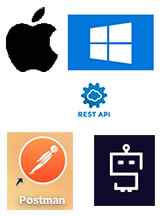

<table style= "background-color: transparent; border-color: transparent;">
<tbody>
<tr>
<td colspan="4"><h3> <em>Clicking in the table below will take you to the associated repo.</em>  </h3></td>
</tr>

<tr>
    <td style="border: none;" align="left" width="20%">&nbsp;</td>
    <td colspan="3">
<a href="https://TechWriterLisa.com/"> 
    <b>My Portfolio/Resume</b>  </a></td>
</tr>

<tr>
<td style="border: none;" align="left" width="20%">&nbsp;</td>
<td colspan="3">
<a href="https://github.com/TechWriterLisa/My-Python/"><b>My Python</b></a></td>
</tr>

</tbody>
</table>

